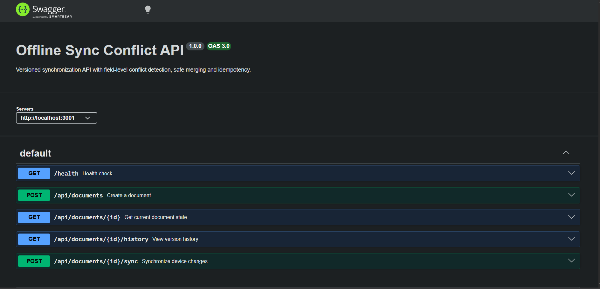

# Offline Sync Conflict Resolution

A backend system for handling offline changes from multiple devices and resolving synchronization conflicts when devices disagree about the latest version of a document.

## Overview

Modern applications often allow users to work offline. Multiple devices can modify the same data while disconnected from the server, creating synchronization conflicts when they reconnect.

This project implements a version-based synchronization mechanism that:

- Tracks document versions
- Accepts changes based on the client's known version
- Detects stale updates
- Automatically merges non-conflicting changes
- Detects conflicting changes to the same field
- Preserves document change history
- Prevents duplicate operations from being applied multiple times

The goal is to provide predictable and safe synchronization instead of silently overwriting data.

---

## Problem Statement

Consider a document stored on a server:

```text
Title: My Note
Color: Blue
Version: 0
```

Two devices work offline at the same time.

### Device 1

Changes:

```text
Title → Phone Note
```

### Device 2

Changes:

```text
Color → Green
```

Both devices started from:

```text
Version: 0
```

When Device 1 synchronizes first:

```text
Version 0 → Version 1
```

The server now contains:

```text
Title: Phone Note
Color: Blue
Version: 1
```

When Device 2 synchronizes, its update is based on Version 0.

The server detects that Device 2 is behind, but its change affects a different field.

Therefore the changes can safely be merged:

```text
Title: Phone Note
Color: Green
Version: 2
```

However, if Device 2 had also changed `Title`, the server would detect a conflict because both devices modified the same field.

---

## Sync Strategy

The synchronization process uses optimistic version tracking.

Each document contains a version number.

The client sends its last known version when synchronizing:

```json
{
  "baseVersion": 0,
  "changes": [
    {
      "field": "title",
      "value": "Phone Note"
    }
  ]
}
```

The server compares the client's `baseVersion` with the current document version.

### Case 1 — No Conflict

```text
Client Version = Server Version
```

The changes can be applied directly.

```text
ACCEPTED
```

---

### Case 2 — Non-Conflicting Changes

```text
Client Version < Server Version
```

The server checks which fields changed after the client's version.

If the client modified a different field, the changes can be merged.

```text
MERGED
```

---

### Case 3 — Conflicting Changes

If both the server and client changed the same field:

```text
Client changed → title
Server changed → title
```

The server does not silently overwrite either value.

Instead, the API returns a conflict response so that the conflict can be resolved explicitly.

```text
CONFLICT
```

---

## Features

### Version Tracking

Every successful synchronization creates a new document version.

### Conflict Detection

The server identifies when multiple devices modify the same field.

### Automatic Merge

Changes affecting different fields can be merged automatically.

### Change History

Previous versions and synchronization operations are retained for auditing and debugging.

### Idempotent Operations

Each synchronization request contains an operation ID.

If the same operation is submitted again, it is not applied twice.

### Offline-First Design

Devices can make changes while disconnected and synchronize them later.

---

## Architecture

```text
┌─────────────────────┐
│      Device 1       │
│   Offline Changes   │
└──────────┬──────────┘
           │
           │ Sync
           ▼
┌─────────────────────────────┐
│        REST API             │
│                             │
│  Express + TypeScript       │
│                             │
│  ┌───────────────────────┐  │
│  │ Conflict Detection    │  │
│  │ Version Tracking      │  │
│  │ Field-Level Merge     │  │
│  │ Idempotency           │  │
│  └───────────────────────┘  │
└──────────────┬──────────────┘
               │
               ▼
        ┌─────────────┐
        │   SQLite    │
        │             │
        │ Documents   │
        │ Versions    │
        │ History     │
        │ Operations  │
        └─────────────┘
               ▲
               │
               │ Sync
┌──────────────┴──────────────┐
│          Device 2           │
│       Offline Changes       │
└─────────────────────────────┘
```

---

## Tech Stack

| Technology | Purpose |
|---|---|
| Node.js | Runtime |
| TypeScript | Application development |
| Express.js | REST API |
| SQLite | Persistent database |
| better-sqlite3 | SQLite database access |
| Zod | Request validation |
| Swagger / OpenAPI | API documentation |
| Vitest | Testing |
| npm | Package management |

---

## API

### Create Document

```http
POST /api/documents
```

Example request:

```json
{
  "data": {
    "title": "My Note",
    "color": "Blue"
  }
}
```

---

### Synchronize Document

```http
POST /api/documents/{id}/sync
```

Example:

```json
{
  "operationId": "phone-001",
  "deviceId": "phone",
  "baseVersion": 0,
  "changes": [
    {
      "field": "title",
      "value": "Phone Note"
    }
  ]
}
```

---

### Get Document

```http
GET /api/documents/{id}
```

Returns the current document and its version.

---

### Get Document History

```http
GET /api/documents/{id}/history
```

Returns previous document versions and synchronization history.

---

## Example Synchronization Flow

### Initial Document

```text
Version: 0

Title: My Note
Color: Blue
```

### Device 1

```text
Device: phone
Base Version: 0

Title → Phone Note
```

Result:

```text
ACCEPTED

Version: 1
Title: Phone Note
Color: Blue
```

### Device 2

Device 2 was still using Version 0:

```text
Device: laptop
Base Version: 0

Color → Green
```

Because Device 2 modified a different field:

```text
MERGED

Version: 2
Title: Phone Note
Color: Green
```

### Conflicting Update

If Device 2 instead sends:

```text
Device: laptop
Base Version: 0

Title → Laptop Note
```

while the server already contains:

```text
Title → Phone Note
```

the server detects a conflict.

The original server value is not silently overwritten.

---

## Running Locally

### 1. Clone the repository

```bash
git clone https://github.com/pooja23182/Offline-Sync-Conflict-When-Devices-Disagree.git
```

Move into the project:

```bash
cd Offline-Sync-Conflict-When-Devices-Disagree
```

### 2. Install dependencies

```bash
npm install
```

### 3. Start the development server

```bash
npm run dev
```

The API will be available at:

```text
http://localhost:3001
```

---

## API Documentation

Once the server is running, open:

```text
http://localhost:3001/docs
```

The Swagger interface provides an interactive way to explore and test the API.

## Swagger Screenshot



---

## Testing

Run the automated tests with:

```bash
npm test
```

For a test run with coverage, if configured:

```bash
npm run test:coverage
```

---

## Example Test Scenario

A basic conflict test can be performed using Swagger, Postman, or another API client.

### Step 1 — Create a document

```http
POST /api/documents
```

```json
{
  "data": {
    "title": "My Note",
    "color": "Blue"
  }
}
```

### Step 2 — Device 1 updates the title

```json
{
  "operationId": "phone-001",
  "deviceId": "phone",
  "baseVersion": 0,
  "changes": [
    {
      "field": "title",
      "value": "Phone Note"
    }
  ]
}
```

Expected result:

```text
ACCEPTED
```

### Step 3 — Device 2 updates another field

```json
{
  "operationId": "laptop-001",
  "deviceId": "laptop",
  "baseVersion": 0,
  "changes": [
    {
      "field": "color",
      "value": "Green"
    }
  ]
}
```

Expected result:

```text
MERGED
```

### Step 4 — Device 2 attempts a conflicting update

```json
{
  "operationId": "laptop-002",
  "deviceId": "laptop",
  "baseVersion": 0,
  "changes": [
    {
      "field": "title",
      "value": "Laptop Note"
    }
  ]
}
```

Expected result:

```text
CONFLICT
```

---

## Design Principles

### No Silent Data Loss

Conflicting changes are explicitly identified instead of silently overwriting existing data.

### Optimistic Concurrency

Clients synchronize using the version they last observed.

### Field-Level Conflict Detection

Conflicts are detected at the field level rather than treating the entire document as one indivisible object.

### Idempotent Synchronization

Repeated requests with the same operation ID do not create duplicate changes.

### Auditable Changes

Document history makes it possible to inspect how the current state was produced.

---

## Project Structure

```text
.
├── src/
├── tests/
├── screenshots/
│   └── swagger.png
├── .env.example
├── .gitignore
├── package.json
├── package-lock.json
├── tsconfig.json
└── README.md
```

---

## Future Improvements

- Client-side offline queue
- Automatic retry for failed synchronization
- More advanced field-level merge strategies
- Manual conflict resolution UI
- Multi-user authentication
- Device registration
- WebSocket-based synchronization
- PostgreSQL support for production deployments
- Docker support
- Cloud deployment
- Sync metrics and monitoring

---

## License

This project is created for learning and demonstration purposes.
